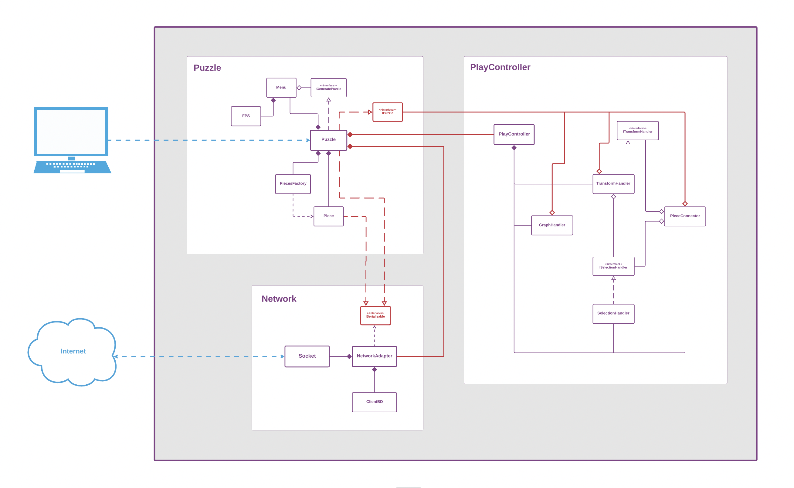

# Puzzelin

An online puzzle for family and friends. This is still a work in progess but the app should be relative stable and playable in Chrome, Safari and on iPad.

**[Try it out!](https://puzzelin.netlify.app)**

## Browser & Device Compatibility
- 🟢 **Chrome** - Good FPS & Full Support;
- 🟡 **Firefox** - Bad FPS;
- 🟡 **Edge** - To be determined;
- 🟡 **Safari** - Ok FPS & can't load large images;
- 🟢 **iPad** - OK FPS & Good touch suppport;

## Installation

Run `npm install` followed by `npm start` and you should be good to go!

## About the code
   * **Frontend Stack:** [HMTL, CSS, Typescript, P5.js];
   * **Backend Stack:** Firebase for realtime communication (not implemented);
   * **Paradigm:** Mostly OOP, with some helper functions;
   * **Modules:** Configured to run "module-less";
   * **Class Diagram:** Slightly outdated...

### Readup!
* [Determine if a point is inside a curve](https://scicomp.stackexchange.com/questions/16343/how-to-determine-if-a-point-is-outside-or-inside-a-curve#:~:text=There's%20a%20simple%20test%20to,region%3B%20otherwise%2C%20it's%20outside.)
* [Fill p5 shape with image](https://stackoverflow.com/questions/60179313/how-to-fill-p5-js-shape-with-an-image)
* [Find Bezier Points](https://stackoverflow.com/questions/7715788/find-bezier-control-points-for-curve-passing-through-n-points)
* [Zoom effect with p5](https://stackoverflow.com/questions/57131714/create-zoom-effect-with-p5-js)
* [Rotate points around origin](https://stackoverflow.com/questions/45357715/how-to-rotate-point-around-another-one/45360970)
* [Transformations in p5](https://genekogan.com/code/p5js-transformations/)
